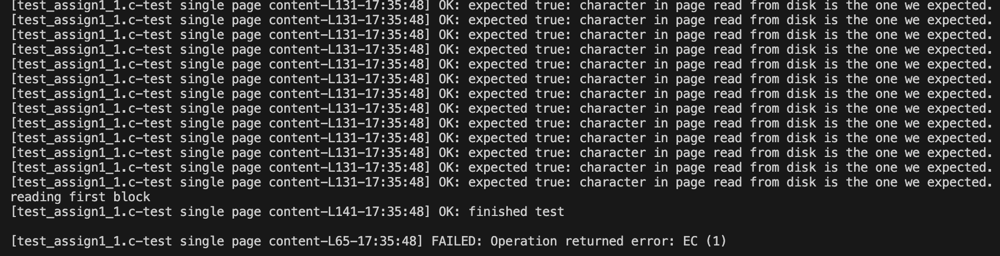
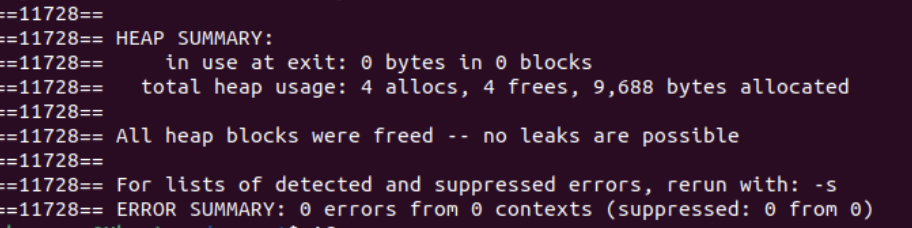

**Storage Manager Module**

**Overview**
The Storage Manager module provides functions for managing page files. It allows users to create, open, read, write, and close page files. 
This README provides an overview of the module's functionality, usage instructions, contributions from team members, and an example of 
test case execution.

**Features**
Page File Management: Functions for creating, opening, closing, and destroying page files.
Block Operations: Functions for reading and writing blocks of data to/from page files.
Block Positioning: Functions for moving the current block position within a page file.
Capacity Management: Functions for appending empty blocks and ensuring a minimum number of total pages in a page file.
How to Use
Include Header: Include the header file storage_manager.h in your source code.

Initialize: Call initStorageManager() to initialize the storage manager.

**Page File Operations**:

Create a page file using createPageFile(char *fileName).

Open an existing page file using openPageFile(char *fileName, SM_FileHandle *fHandle).

Close a page file using closePageFile(SM_FileHandle *fHandle).

Destroy a page file using destroyPageFile(char *fileName).

**Block Operations**:

Read a block from a page file using readBlock(int pageNum, SM_FileHandle *fHandle, SM_PageHandle memPage).

Write a block to a page file using writeBlock(int pageNum, SM_FileHandle *fHandle, SM_PageHandle memPage).
Block Positioning:

Get the current block position using getBlockPos(SM_FileHandle *fHandle).

Move to the first block using readFirstBlock(SM_FileHandle *fHandle, SM_PageHandle memPage).

Move to the previous block using readPreviousBlock(SM_FileHandle *fHandle, SM_PageHandle memPage).

Move to the current block using readCurrentBlock(SM_FileHandle *fHandle, SM_PageHandle memPage).

Move to the next block using readNextBlock(SM_FileHandle *fHandle, SM_PageHandle memPage).

Move to the last block using readLastBlock(SM_FileHandle *fHandle, SM_PageHandle memPage).

**Capacity Management**:

Append an empty block using appendEmptyBlock(SM_FileHandle *fHandle).

Ensure a minimum number of total pages using ensureCapacity(int numberOfPages, SM_FileHandle *fHandle).

**Error Handling**:

Functions return error codes defined in dberror.h.
Use printError(RC error) to print error messages.
Use errorMessage(RC error) to get error messages as strings.

**Testing**

We have provided a test file `test_assign1.c` that runs all the test cases for the storage manager functions. The tests include checking for 
correct file creation, opening, closing, reading, and writing operations.
To run the tests, compile the test file along with the necessary dependencies using the provided Makefile. After compiling, execute the 
`test_assign1` binary.

Below is a run of test_assign1

**Makefile**

The Makefile provided in the repository compiles the `test_assign1` binary from `test_assign1.c`, `dberror.c`, and all the C files implementing 
the storage manager interface.

**Memory Leaks**

We have thoroughly checked for memory leaks using Valgrind to ensure that our code is memory-efficient and free from memory-related issues.
Valgrind: Valgrind's programming tool suite is used for memory debugging, profiling, and memory leak detection. 
It is a commonly used tool in the C programming community for memory-related error detection and code quality
improvement. Programmers can detect memory leaks, invalid memory access, and other memory-related problems in their programs with 
the use of a suite of tools offered by Valgrind.

Here are a few of Valgrind's salient features:

Memory Leak Detection: By monitoring memory allocations and deallocations, Valgrind is able to identify memory leaks. 
It assists developers in identifying sections of their code where memory is not being managed appropriately by
identifying memory blocks that were allocated but not released.

Memory Error Detection: Valgrind is capable of identifying a number of memory-related mistakes, including reading from and writing to 
freed or unallocated memory.

Using this command we can detect if there are any errors

valgrind --tool=memcheck ./storage_manager.c

Below is a run on Ubuntu

**Team Contributions**

Manju:
Wrote Below Functions and performed Testing on it.

initStorageManager(void)

createPageFile(char *fileName)

openPageFile(char *fileName, SM_FileHandle *fHandle)

closePageFile(SM_FileHandle *fHandle)

destroyPageFile(char *fileName)

readBlock(int pageNum, SM_FileHandle *fHandle, SM_PageHandle memPage)

getBlockPos(SM_FileHandle *fHandle)

readFirstBlock(SM_FileHandle *fHandle, SM_PageHandle memPage)

readPreviousBlock(SM_FileHandle *fHandle, SM_PageHandle memPage)

readCurrentBlock(SM_FileHandle *fHandle, SM_PageHandle memPage)

writeBlock(int pageNum, SM_FileHandle *fHandle, SM_PageHandle memPage)

ensureCapacity(int numberOfPages, SM_FileHandle *fHandle)

readNextBlock(SM_FileHandle *fHandle, SM_PageHandle memPage)

Rupa:

Wrote Below Functions and performed Testing on it.

readLastBlock(SM_FileHandle *fHandle, SM_PageHandle memPage)

Additional contribution to writeBlock(int pageNum, SM_FileHandle *fHandle, SM_PageHandle memPage)

Vanaja:

Wrote Below Functions and performed Testing on it. Performed Memory Leaks testing.

appendEmptyBlock(SM_FileHandle *fHandle)

Memory Leaks

Mohit:
Wrote Below Functions and performed Testing on it. Performed Memory Leaks testing.

writeCurrentBlock(SM_FileHandle *fHandle, SM_PageHandle memPage)

Memory Leaks

**Additional Notes**
Make sure to link the storage_manager.c and dberror.c files with your project when compiling.
Error handling is essential. Always check the return codes of storage manager functions and handle errors appropriately.